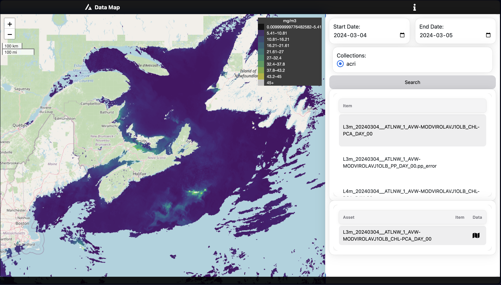

# SIMBA  Système Intégré de Modélisation de la Baleine noire de l’Atlantique 
## Visualization platform for remote sensing and model products

<link rel="stylesheet" href="https://cdnjs.cloudflare.com/ajax/libs/font-awesome/5.15.3/css/all.min.css">

- [SIMBA  Système Intégré de Modélisation de la Baleine noire de l’Atlantique](#simba--système-intégré-de-modélisation-de-la-baleine-noire-de-latlantique)
  - [Visualization platform for remote sensing and model products](#visualization-platform-for-remote-sensing-and-model-products)
- [Navigatge to the webmap: whales.github.io](#navigatge-to-the-webmap-whalesgithubio)
  - [Navigate to the User Guide : User Guide](#navigate-to-the-user-guide--user-guide)
  - [Product description](#product-description)
  - [Webmap](#webmap)

   
# Navigatge to the webmap: [whales.github.io](https://geoanalytics-ca.github.io/whales.github.io/)

Powered by [Folium]() and [STAC]()

## Navigate to the User Guide : [User Guide](user-guide.md)

## Product description 

- [Ocean Color Radiometric product description](ATBD_report/SIMBA_OCR_Report_V2.1.1_Signed.pdf)
- [Chlorophyll ATBD](ATBD_report/SIMBA_Chla_ATBD_V2.3.2_Signed.pdf)
- [Phenology ATBD](ATBD_report/SIMBA_Phenology_ATBD_V2.1.1_Signed.pdf)
- [Models description](ATBD_report/FinalReport_Modelisation_SIMBA_MS6_TJ.pdf)

## Webmap

