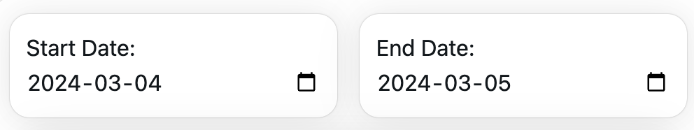
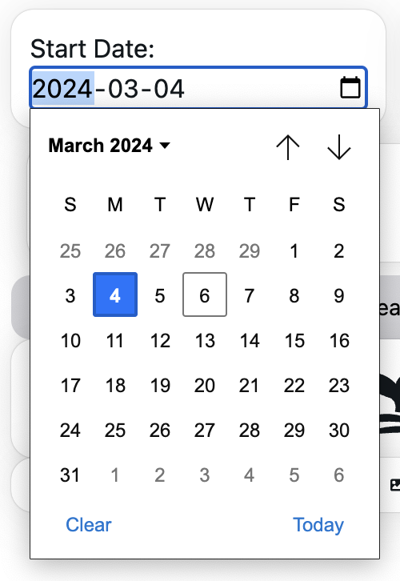
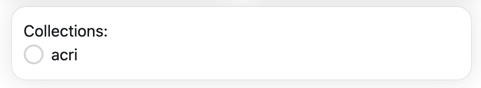
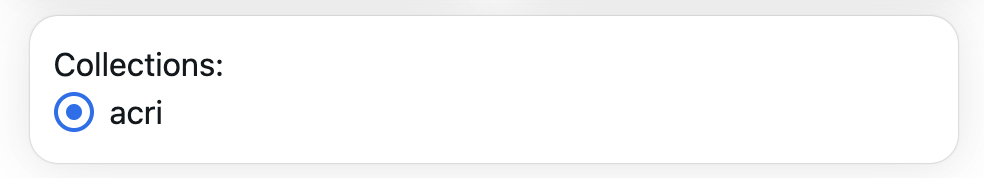
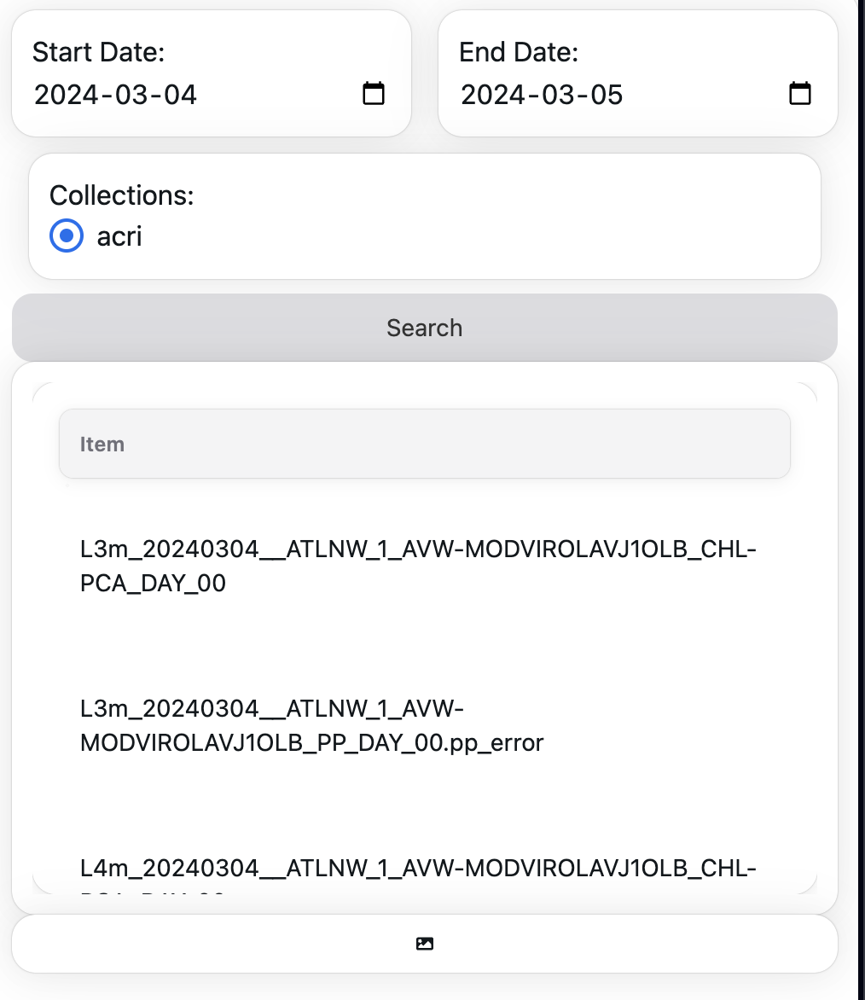
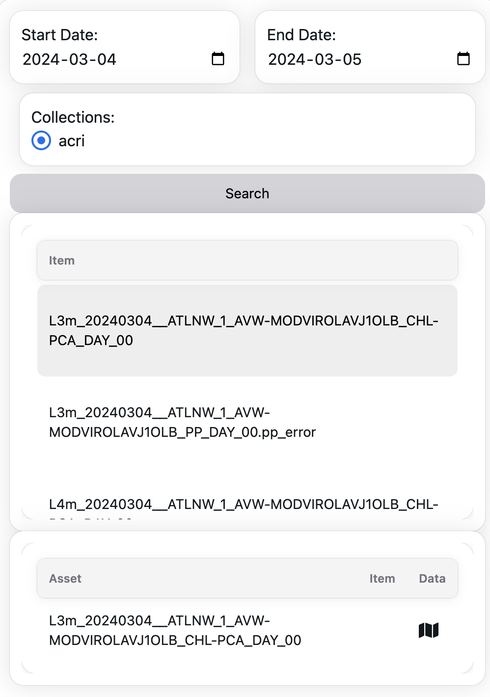
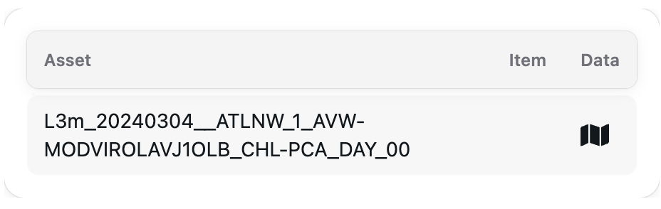

# User Guide

### Start/End Date

The Start and End Date selection provides a way to query Assets over a specific temporal range. 

To define your time frame, click on the date field to open the date picker. You can easily navigate through different months and years. Once you find the desired date, click on it to select. The selected date will then be displayed in the date field.

### Collections

Select the STAC Collection you want to query from. 

The image above illustrates the collection selection interface. Once you have made your selection, it will be highlighted as shown below.

### Item Results

Once a query has completed, a set of STAC Items will be listed for you to select from.

### Asset Visualisation

After selecting an Item, the associated Assets will be displayed for your further selection.

The Assets associated to the selected Item will be listed and available for visualisation. Clicking the <i class="fas fa-camera"></i> icon will create a pop-up model of the Asset preview plot. The <i class="fas fa-map"></i> icon will visualise the remote data onto the map.

